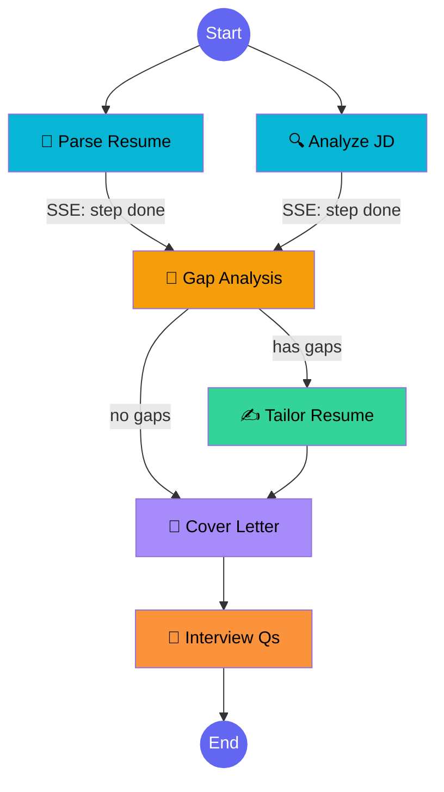

# Autonomous Job Application Agent

An AI-powered, multi-step agent that analyzes your resume against a job description — identifies skill gaps, rewrites resume bullets, generates a tailored cover letter, and prepares interview questions. Built with **LangGraph** for orchestration, **FastAPI** for the backend, and **Angular** for a polished dark-themed UI.

---

## Demo

### Input — Upload Resume & Paste JD
> Upload a PDF/TXT resume, paste a job description, choose the number of interview questions (5–30), and hit **Analyze & Generate**.

### Real-Time Pipeline Progress (SSE)
> Each step lights up in real time as the backend completes it — no fake timers. Powered by Server-Sent Events streaming from LangGraph's `graph.stream()`.

```
📄 Parsing Resume    ✓ done
🔍 Analyzing JD      ✓ done
🎯 Gap Analysis      ✓ done
✍️ Tailoring Resume   ● in progress...
📝 Cover Letter      ○ pending
💬 Interview Qs      ○ pending
```

### Results — Score Ring, Gap Cards, Tailored Bullets, Cover Letter, Interview Qs
> ATS-weighted match score (must-haves count 3×), skill gap cards with importance badges, diff-style tailored bullets, copy/download cover letter, and configurable interview questions. Export everything as a formatted PDF.

---

## Architecture



### Key Design Decisions

| Decision | Rationale |
|----------|-----------|
| **Parallel execution** | Resume parsing and JD analysis are independent — run simultaneously via LangGraph fan-out |
| **Conditional routing** | Skip resume tailoring when there are no gaps (save LLM calls + time) |
| **SSE streaming** | Real-time step progress via `graph.stream()` → Server-Sent Events → `fetch` ReadableStream |
| **Vector caching** | ChromaDB similarity search returns instant results for similar JDs (85% threshold) |
| **Retry with backoff** | Auto-retry on rate limits, timeouts, 503s — essential for free-tier LLM APIs |
| **ATS-weighted scoring** | Must-have requirements weighted 3× vs nice-to-haves for realistic match percentages |
| **Async backend** | `asyncio.to_thread` prevents blocking the FastAPI event loop during long LLM calls |
| **Structured output** | Pydantic models + `with_structured_output` guarantee valid JSON from the LLM |

---

## Tech Stack

| Layer | Technology |
|-------|-----------|
| AI Orchestration | LangGraph + LangChain |
| LLM | Groq (Llama 3.3 70B) — free tier |
| Structured Output | Pydantic models with field descriptions |
| Vector Store | ChromaDB (local, persistent) |
| Backend API | FastAPI (async + SSE streaming) |
| Frontend | Angular 20, Signals, standalone components |
| Real-Time | Server-Sent Events (SSE) via `fetch` ReadableStream |
| PDF Export | jsPDF (client-side generation) |
| Testing | pytest — 13 mocked unit tests + 9 integration tests |

---

## Project Structure

```
job-agent-project/
├── agent/                          # AI Agent Core
│   ├── state.py                    # TypedDict shared state definition
│   ├── models.py                   # Pydantic schemas (ResumeData, JDData, GapAnalysis, etc.)
│   ├── llm.py                      # LLM config, retry + structured invoke helpers
│   ├── nodes.py                    # 6 node functions (parse, analyze, gap, tailor, cover, interview)
│   ├── graph.py                    # LangGraph StateGraph wiring (parallel + conditional)
│   ├── pipeline.py                 # Pipeline runner — caching, invoke, and SSE streaming
│   └── vector_store.py             # ChromaDB caching layer with similarity search
│
├── api/                            # FastAPI Backend
│   ├── main.py                     # REST + SSE endpoints (/analyze, /analyze/stream, /health)
│   └── file_parser.py              # Resume text extraction (PDF via PyPDF2, TXT)
│
├── tests/                          # Test Suite
│   ├── conftest.py                 # Sample resume & JD fixtures
│   ├── test_nodes.py               # 13 unit tests with mocks (no API key needed)
│   ├── test_api.py                 # 9 integration tests (requires running server)
│   └── test_pipeline.py            # Pipeline integration tests
│
├── frontend/                       # Angular 20 Frontend
│   └── src/app/
│       ├── components/analyze/     # Main UI — input form, pipeline animation, results
│       ├── models/                 # TypeScript interfaces matching API response
│       └── services/               # API service (REST + SSE streaming client)
│
├── .env.example                    # Environment variable template
├── .gitignore
├── requirements.txt
└── README.md
```

---

## Features

| Feature | Description |
|---------|-------------|
| 📄 **Resume Parsing** | Extracts skills, experience, education from PDF or plain text |
| 🔍 **JD Analysis** | Classifies each requirement as must-have or nice-to-have |
| 🎯 **Gap Analysis** | Identifies unmet requirements with importance level and explanation |
| ✍️ **Resume Tailoring** | Rewrites bullet points to address gaps without fabricating experience |
| 📝 **Cover Letter** | Role-specific cover letter using the candidate's actual name |
| 💬 **Interview Prep** | Configurable 5–30 questions (technical, behavioral, gap-probing) |
| 📊 **ATS Weighted Score** | Visual score ring — must-haves weighted 3× for realistic matching |
| ⚡ **Smart Caching** | Similar JDs return instant results via ChromaDB similarity search |
| 📡 **Real-Time Progress** | SSE streaming shows actual pipeline step completion (no fake timers) |
| 📥 **PDF Export** | Download complete analysis as a formatted PDF |
| 🌙 **Dark Theme UI** | Gradient hero, animated pipeline, drag-and-drop upload, pill tabs |

---

## Quick Start

### Prerequisites

- Python 3.12+
- Node.js 18+
- A free [Groq API key](https://console.groq.com/keys)

### Setup

```bash
# Clone and enter project
git clone <repo-url>
cd job-agent-project

# Backend setup
python -m venv .venv
.venv\Scripts\Activate.ps1          # Windows
# source .venv/bin/activate          # macOS/Linux

pip install -r requirements.txt

# Create .env from example
cp .env.example .env
# Edit .env and add your GROQ_API_KEY

# Frontend setup
cd frontend
npm install
cd ..
```

### Run

```bash
# Terminal 1 — Backend
python -m uvicorn api.main:app --reload --port 8000

# Terminal 2 — Frontend
cd frontend
npx ng serve --port 4200
```

Open [http://localhost:4200](http://localhost:4200)

### Tests

```bash
# Unit tests (no API key needed — uses mocks)
python -m pytest tests/test_nodes.py -v

# Integration tests (requires running backend)
python -m pytest tests/test_api.py -v
```

---

## API Endpoints

| Method | Endpoint | Description |
|--------|----------|-------------|
| `GET` | `/api/health` | Health check — returns `{"status": "ok"}` |
| `POST` | `/api/analyze` | Full analysis (JSON response) |
| `POST` | `/api/analyze/stream` | Full analysis with **real-time SSE streaming** |

### SSE Event Format (`/api/analyze/stream`)

```
event: step
data: {"node": "parse_resume", "status": "done"}

event: step
data: {"node": "analyze_jd", "status": "done"}

event: step
data: {"node": "gap_analysis", "status": "done"}

...

event: result
data: {"cached": false, "resume_data": {...}, "gaps": [...], ...}
```

---

## How It Works

1. **Upload** a resume (PDF/TXT) and paste a job description
2. **Parse** — LLM extracts structured data from both documents in parallel
3. **Analyze** — Gap analysis identifies missing skills with importance weighting
4. **Tailor** — Resume bullets are rewritten to address gaps (if any exist)
5. **Generate** — A role-specific cover letter and interview questions are produced
6. **Score** — ATS-weighted match percentage (must-haves = 3× weight)
7. **Cache** — Results are stored in ChromaDB for instant retrieval on similar JDs

